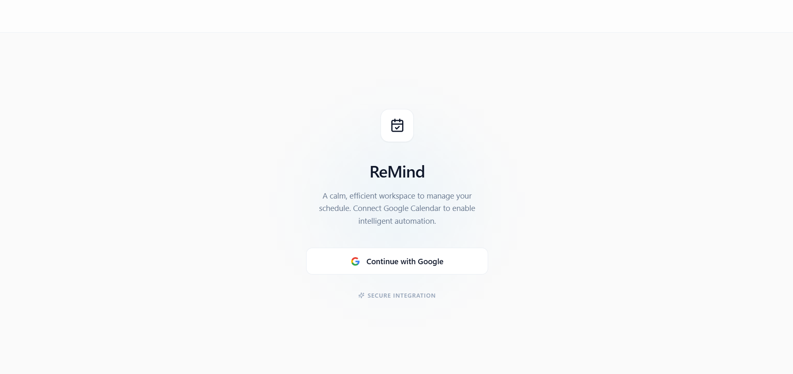
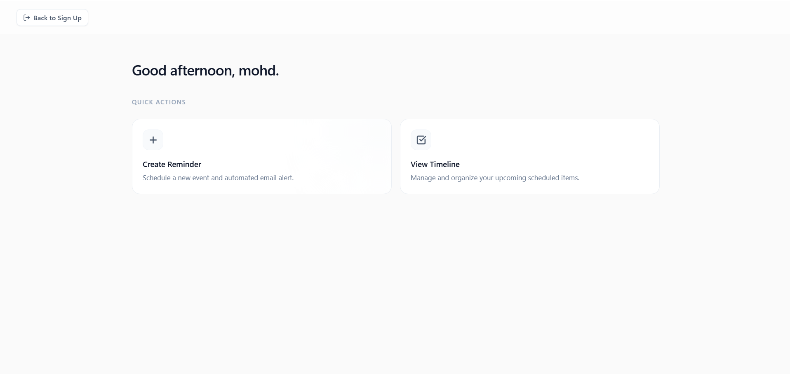
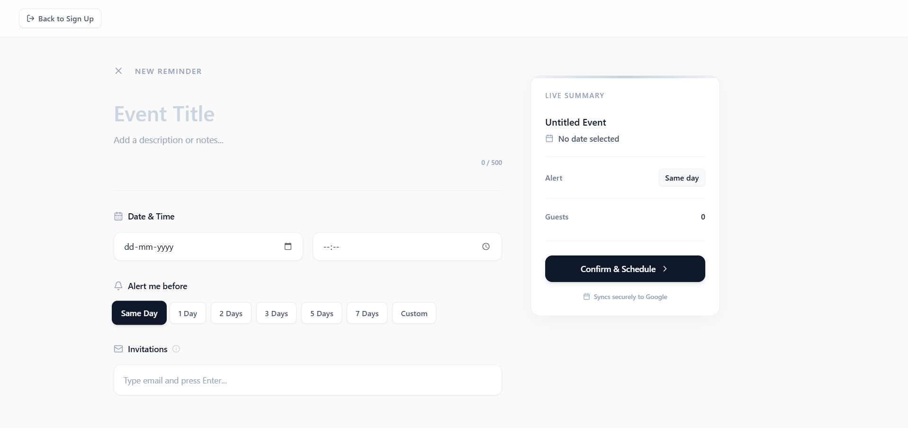
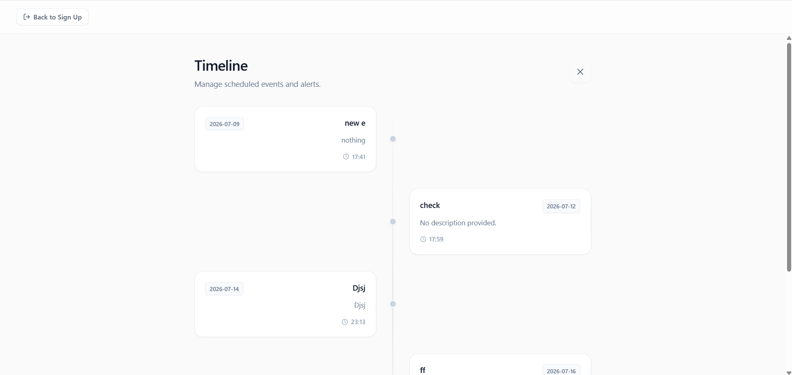
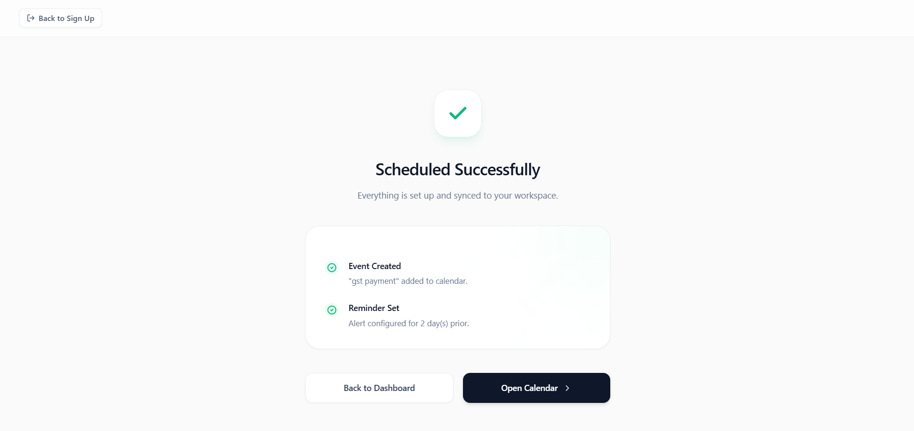

# ReMind 📅🔔

A full-stack Google Calendar reminder manager built with **Spring Boot** and **React**. ReMind allows users to securely authenticate with Google, create calendar reminders, invite attendees, view existing events, and delete reminders through a clean, responsive interface.

> Built using the Google Calendar API and Google OAuth 2.0 Authorization Code Flow.

---

## 🚀 Live Demo

🌐 **Frontend:** *(https://google-calender-api-client-re-mind.vercel.app/)*
---

## ✨ Features

- 🔐 Secure Google OAuth 2.0 Login
- 📅 Create Google Calendar Events
- 🔔 Configure Custom Reminders
- 👥 Invite Multiple Attendees
- 📋 View Existing Calendar Events
- 🗑️ Delete Calendar Events
- 📱 Installable Progressive Web App (PWA)
- ⚡ Automatic Backend Warm-Up to Reduce Cold Starts
- 🎨 Responsive Modern UI

---

# Screenshots


## Login



## Dashboard



## Create Reminder



## View & Delete Events



## Submission page



# Tech Stack

## Frontend

- React
- Axios
- Framer Motion
- Lucide React
- Google OAuth React SDK
- Progressive Web App (PWA)
- Vercel

## Backend

- Java 21
- Spring Boot
- Spring MVC
- Google Calendar API
- Google OAuth 2.0
- HTTP Sessions
- Docker
- Render

---

# Application Workflow

```text
User
 │
 ▼
Login with Google
 │
 ▼
Google OAuth 2.0
 │
 ▼
Authorization Code
 │
 ▼
Spring Boot exchanges code
for Access Token & ID Token
 │
 ▼
HTTP Session Created
 │
 ▼
Google Calendar API
 ├───────────────┐
 │               │
 ▼               ▼
Create Event   View Events
 │
 ▼
Delete Event
```

---

# Features Overview

## Authentication

- Secure Google OAuth 2.0 Authorization Code Flow
- Server-side session management
- No passwords stored

---

## Reminder Management

Users can

- Create reminders
- Set event title
- Add descriptions
- Select date and time
- Configure reminder notifications
- Add multiple invitee email addresses

---

## Event Management

- View existing reminders
- Delete reminders instantly
- Direct synchronization with Google Calendar

---

# API Endpoints

## Exchange Authorization Code

```
POST /api/create-tokens
```

Request

```json
{
  "code": "authorization_code"
}
```

---

## Get Logged-in User

```
GET /api/user
```

Returns

```json
{
    "name":"John Doe",
    "email":"john@gmail.com"
}
```

---

## Create Event

```
POST /api/events
```

Creates a Google Calendar event.

---

## View Events

```
GET /api/events
```

Returns

```json
[
  {
    "eventId":"...",
    "eventName":"Meeting",
    "description":"Weekly Sync",
    "startDate":"2026-07-10",
    "startTime":"10:00"
  }
]
```

---

## Delete Event

```
DELETE /api/events/{eventId}
```

Deletes the specified calendar event.

---

# Google OAuth Notice

Since this application is currently in Google's OAuth verification process, Google may display the following warning during the first login:

> **Google hasn't verified this app**

To continue,

```
Advanced
↓
Continue to ReMind
```

This warning is expected for applications using sensitive Google Calendar scopes before verification.

ReMind only requests permissions required to:

- Read Calendar Events
- Create Calendar Events
- Delete Calendar Events

No passwords are collected or stored.

---

# Install as a Progressive Web App

For the best experience:

### Desktop

Open using

- Google Chrome
- Microsoft Edge

Click

```
Install ReMind
```

---

### Mobile

Select

```
Add to Home Screen
```

The application behaves like a native app.

---

# Running Locally

## Clone Repository

```bash
git clone https://github.com/mohdnasar0011/Google-Calender-API-Client---ReMind.git
```

---

## Backend

Configure the following environment variables:

```
GOOGLE_CLIENT_ID
GOOGLE_CLIENT_SECRET
GOOGLE_REDIRECT_URI
```

Run

```bash
./mvnw spring-boot:run
```

---

## Frontend

Create a `.env` file

```
REACT_APP_GOOGLE_CLIENT_ID=
REACT_APP_API_URL=
```

Install dependencies

```bash
npm install
```

Run

```bash
npm start
```

---

# Deployment

| Service | Platform |
|----------|----------|
| Frontend | Vercel |
| Backend | Render (Docker) |

---

# Challenges Solved

This project involved solving several practical engineering challenges:

- Google OAuth 2.0 Authorization Code Flow
- Google Calendar API Integration
- Secure HTTP Session Management
- Cross-Origin Authentication (CORS)
- Cookie-Based Authentication
- Docker Deployment
- Render Cold Start Optimization
- PWA Configuration
- Vercel + Render Integration
- OAuth Redirect URI Configuration

---

# Project Structure

```
Google-Calender-API-Client---ReMind
│
├── frontend
│   ├── src
│   ├── public
│   └── package.json
│
├── backend
│   ├── src
│   ├── pom.xml
│   └── Dockerfile
│
└── README.md
```

---

# Future Improvements

- Edit Existing Events
- Multiple Calendar Support
- Dark Mode
- Recurring Events
- Search & Filtering
- Push Notifications
- Calendar Color Selection

---

# Acknowledgements

- Google Calendar API
- Google OAuth 2.0
- Spring Boot
- React
- Render
- Vercel

---

# Note

The frontend UI was built with assistance from **Google Gemini**, while the backend architecture, Google OAuth integration, Google Calendar API integration, deployment, debugging, and application logic were implemented by my own knowledge.

---

# Author

**Mohd Nasar**

GitHub: https://github.com/mohdnasar0011

If you found this project helpful, consider giving it a ⭐ on GitHub!
